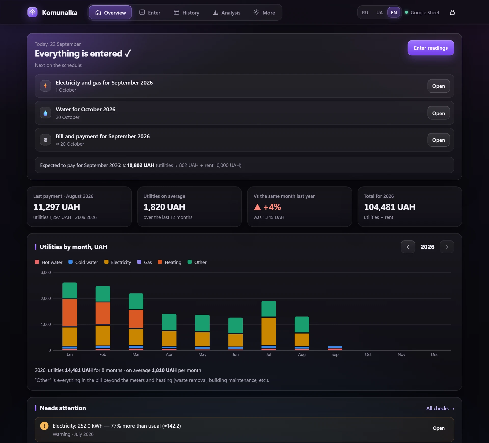
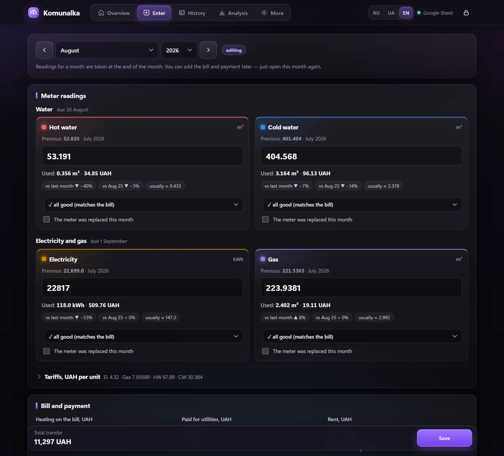
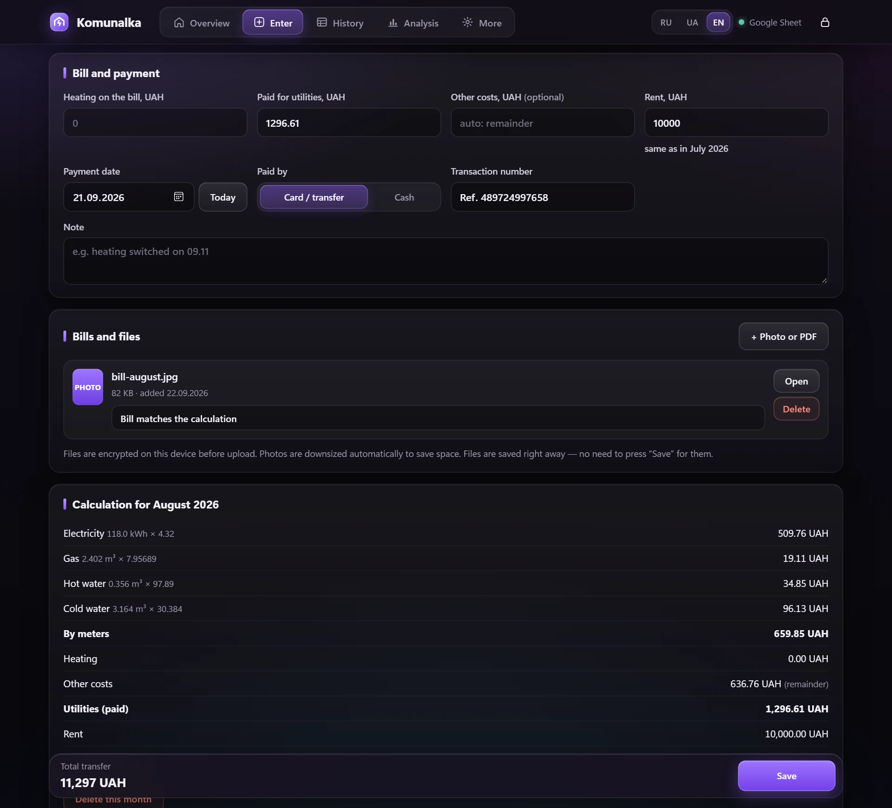
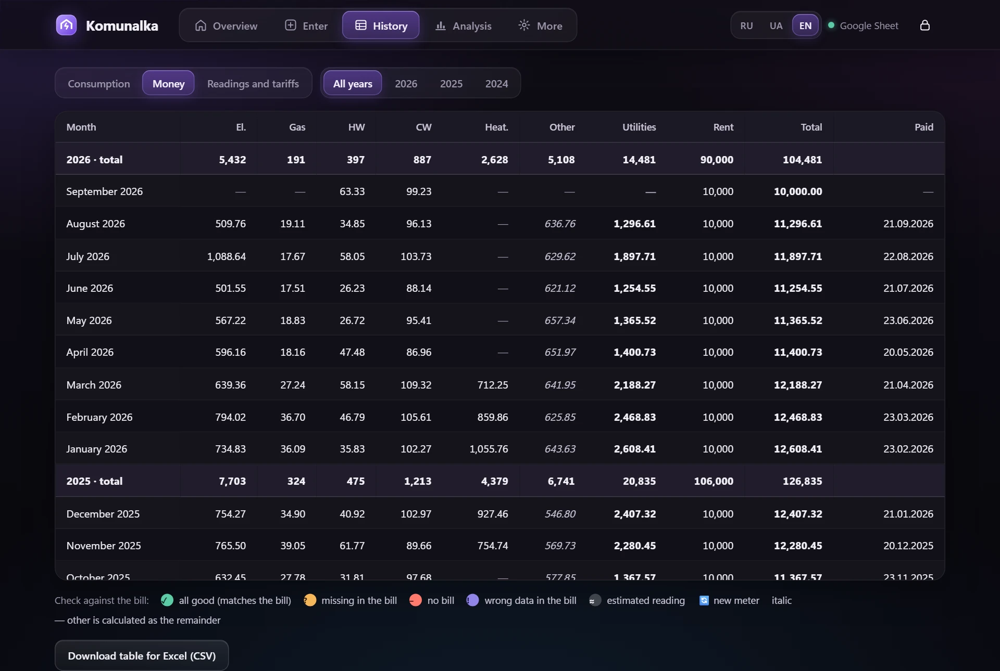
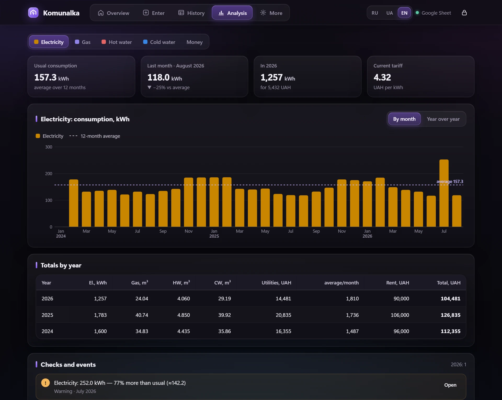
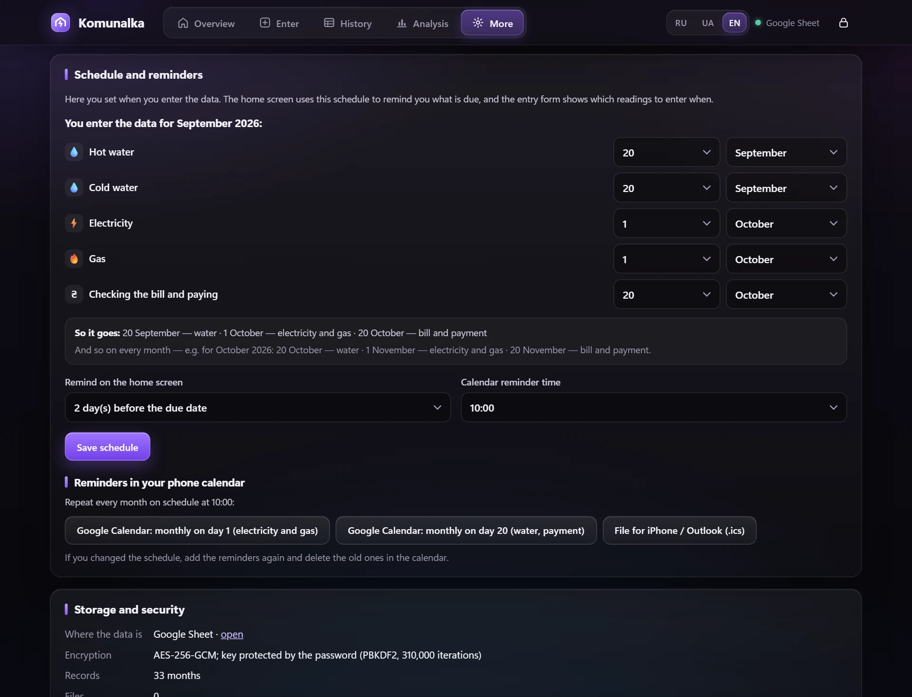
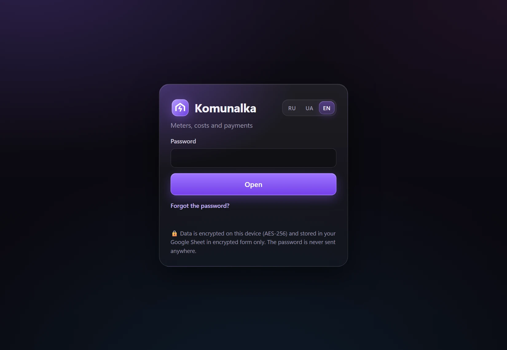
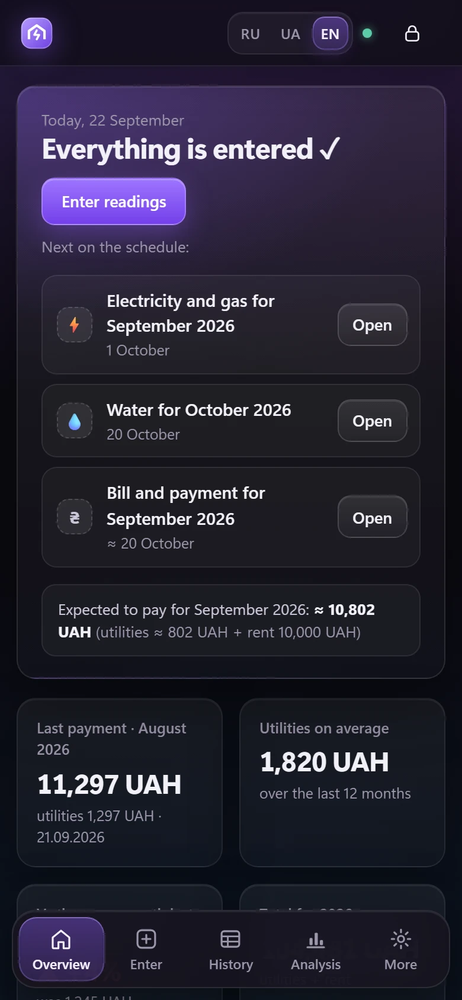
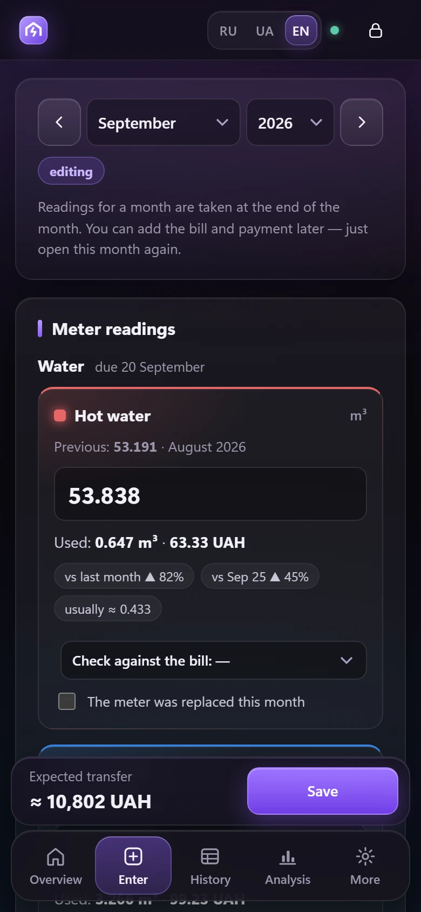
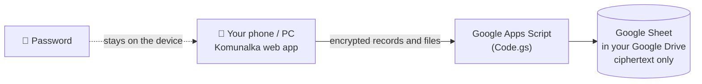

<div align="center">


# Komunalka

**An encrypted utility meter and payment tracker for renters.**<br>
Runs in your own Google account, works on your phone and computer, speaks Russian, Ukrainian and English.


[](LICENSE)

**English** · [Русский](README.ru.md) · [Українська](README.uk.md)



</div>

---

## Contents

- [Why](#why)
- [Features](#features)
- [Screenshots](#screenshots)
- [How your data is protected](#how-your-data-is-protected)
- [Installation (≈10 minutes)](#installation-10-minutes)
- [Everyday use](#everyday-use)
- [Importing your history](#importing-your-history)
- [Backups and recovery](#backups-and-recovery)
- [Updating the app](#updating-the-app)
- [Troubleshooting](#troubleshooting)
- [Project structure](#project-structure)
- [License](#license)
- [Author](#author)

---

## Why

Renting a flat usually means a monthly routine: read the meters, check the bill, transfer the money together with the rent, and keep the numbers somewhere — often in a spreadsheet that slowly becomes hard to read.

Komunalka turns that spreadsheet into a small app:

- it **tells you what is due** according to *your* schedule;
- it **calculates** consumption and cost the moment you type a reading;
- it **spots mistakes** — negative consumption, unusual spikes, duplicated payment numbers;
- it keeps **photos and PDFs of bills** next to the month they belong to;
- and everything is **encrypted on your device** before it reaches Google.

## Features

| | |
|---|---|
| 🗓 **Your schedule** | Choose when each meter is entered and when the bill is paid (e.g. water on the 20th, electricity and gas on the 1st of the next month). The home screen shows what is due, overdue or coming up. |
| ⚡ **Instant calculation** | Consumption, cost per meter, comparison with last month and the same month last year, the “usual” level for the last 12 months. |
| 🧾 **Bills and payments** | Heating, the total you paid, rent, payment date and transaction number. “Other costs” are calculated automatically as the remainder of the bill. |
| 📎 **Attachments** | Photos and PDFs of bills and receipts with comments. Photos are downsized automatically. |
| 📊 **Analysis** | Monthly and year-over-year charts, yearly totals, a shared scale for hot and cold water, and automatic checks. |
| 💱 **Currency** | Hryvnia by default; euro, dollar, złoty, pound and more can be selected in settings. |
| 🔁 **Tariff and rent changes** | Values are carried over from the previous month. Change them once — the app offers to update the following months too. |
| 🔔 **Reminders** | One-tap recurring reminders for Google Calendar, or an `.ics` file for iPhone / Outlook. |
| 🌍 **Three languages** | Russian, Ukrainian, English — switch at any time. |
| 📱 **Phone-friendly** | Add it to the home screen; bottom navigation; the browser *Back* button works inside the app. |
| 🔐 **Private** | AES-256 encryption with your password, auto-lock, access limited to your Google account. |

## Screenshots

> All screenshots use **synthetic demo data**.

<table>
<tr>
<td width="50%"><br><sub><b>Entering readings.</b> Meters are grouped by due date; consumption, cost and comparisons appear as you type.</sub></td>
<td width="50%"><br><sub><b>Bill and payment.</b> Attach a photo of the bill, add a comment, see the full calculation for the month.</sub></td>
</tr>
<tr>
<td><br><sub><b>History.</b> A spreadsheet-like table with consumption, money or raw readings and tariffs, with yearly totals.</sub></td>
<td><br><sub><b>Analysis.</b> Monthly consumption with the 12-month average; year-over-year view; totals by year.</sub></td>
</tr>
<tr>
<td><br><sub><b>Schedule.</b> Set the dates on the example of the current month — the summary below shows how it will work.</sub></td>
<td><br><sub><b>Sign in.</b> The password decrypts the data on your device; it is never sent anywhere.</sub></td>
</tr>
</table>

<p align="center">

&nbsp;&nbsp;

<br><sub>On a phone: home screen and the entry form.</sub>
</p>

## How your data is protected



- **Encryption happens in the browser.** Your password is turned into a key with PBKDF2-SHA-256 (310,000 iterations). That key protects a random 512-bit *data key*; the data key encrypts every month, the settings and every file with **AES-256-GCM**.
- **Google only stores ciphertext.** The spreadsheet contains unreadable strings — no readings, amounts, notes or photos in plain form. Even month names are hidden: record IDs are HMAC values.
- **Access is limited to you.** The web app is deployed as *“Execute as: Me / Who has access: Only myself”*, so only your Google account can open it.
- **Changing the password is instant** — only the small wrapped key is re-encrypted, not all the data.
- **Auto-lock** after 5–60 minutes of inactivity (10 by default).
- **No external code.** The whole app is one HTML file with no third-party scripts.

> [!WARNING]
> **The password cannot be recovered.** Without it the data cannot be decrypted by anyone — including you. Write it down somewhere safe and make an encrypted backup from time to time.

> [!NOTE]
> The CSV export and the history import file are **not** encrypted. Delete them once you no longer need them.

## Installation (≈10 minutes)

You need a Google account. It is easiest to do this on a computer.

**0. Get the files.** On this page click **Code → Download ZIP** and unpack it. You need `Code.gs` and `Index.html`.

> [!TIP]
> Open the files with a plain text editor: right-click → *Open with* → *Notepad*. Double-clicking `Index.html` opens it in a browser instead, which is not what you want here.

1. **Create a spreadsheet.** Go to [sheets.google.com](https://sheets.google.com), create a blank spreadsheet and name it, for example, *Komunalka*.
2. **Open the script editor.** In the spreadsheet menu choose **Extensions → Apps Script**. Rename the project (top left, *Untitled project*) to *Komunalka*.
3. **Add the server part.** The editor already has a file `Code.gs`. Delete its content and paste the whole content of `Code.gs` from this repository.
4. **Add the app.** Next to *Files* click **+ → HTML** and name the file exactly **`Index`** (capital *I*, the editor adds `.html` itself). Delete its content and paste the whole content of `Index.html`. The pasted text must end with `</html>`.
5. **Save** the project (💾 or `Ctrl+S`).
6. **Deploy.** Click **Deploy → New deployment**, click the gear ⚙ next to *Select type* and choose **Web app**:
   - *Description*: `Komunalka`
   - *Execute as*: **Me**
   - *Who has access*: **Only myself**

   Click **Deploy**.
7. **Authorize.** Google asks for permission → **Authorize access** → choose your account. You will see *“Google hasn’t verified this app”* — that is expected for your own script. Click **Advanced → Go to Komunalka (unsafe) → Allow**. The script can access **only this one spreadsheet**.
8. **Copy the web app URL** (it ends with `/exec`) and bookmark it. This is your app.
9. **Open the URL** and create a password (at least 8 characters).
10. **Settings** (*More* tab): choose the currency, enter the landlord’s card number if you like, check the schedule and add calendar reminders.

**On your phone:** open the same `/exec` link in Chrome (Android) or Safari (iPhone) signed in with the same Google account → browser menu → **Add to Home screen**.

## Everyday use

1. **On the due date** (the home screen reminds you) open **Enter**, type the readings and press **Save**. Water, electricity and gas can be entered on different days — just open the same month again.
2. **When the bill arrives and you pay it**, open that month and fill in *Heating*, *Paid for utilities*, the payment date and transaction number. Attach a photo of the bill.
3. **A tariff or the rent changed?** Enter the new value in the **first month** it applies to. The next months will pick it up automatically; if later months already contain the old value, the app offers to replace it there too.
4. **A meter was replaced?** Tick *“The meter was replaced this month”* and enter the starting reading of the new meter.
5. **Look around:** *History* shows everything in a table (tap a row to edit), *Analysis* shows charts and checks.

## Importing your history

If you kept your readings in a spreadsheet, you can load them at once: **More → Load history from Excel (.json)**, or the button on the empty home screen. The file format is simple JSON — see [`docs/import-example.json`](docs/import-example.json):

```json
{
  "app": "komunalka-import",
  "version": 1,
  "settings": { "rent": 10000 },
  "rows": [
    {
      "month": "2026-08",
      "readings": { "el": 22817.0, "gas": 223.9381, "hw": 53.191, "cw": 404.568 },
      "tariffs":  { "el": 4.32, "gas": 7.95689, "hw": 97.89, "cw": 30.384 },
      "status":   { "el": "ok" },
      "heating": 0,
      "paid": 1296.61,
      "rent": 10000,
      "payDate": "2026-09-21",
      "payInfo": "Ref. 489724997658",
      "note": "Any text"
    }
  ]
}
```

| Field | Meaning |
|---|---|
| `month` | `YYYY-MM` — the month the readings belong to |
| `readings` | meter readings: `el` electricity, `gas`, `hw` hot water, `cw` cold water |
| `tariffs` | price per unit for each meter |
| `status` | check against the bill: `ok`, `gap` (missing in the bill), `noblank` (no bill), `wrong`, `est` (estimated) |
| `newMeter` | `{ "cw": 0 }` — the meter was replaced; consumption is counted from this starting value |
| `heating` | heating amount on the bill |
| `other` | other costs (optional; if omitted they are calculated as the remainder of `paid`) |
| `paid` | total paid for utilities (without rent) |
| `rent` | rent for the month |
| `payDate`, `payInfo`, `note` | payment date (`YYYY-MM-DD`), transaction info, free-text note |

The import file is **not** encrypted — delete it after importing.

## Backups and recovery

- **Encrypted backup:** *More → Download encrypted backup*. It is safe to keep anywhere (Google Drive, a USB stick) — it cannot be read without the password. Photos and PDFs are not included; they stay in the spreadsheet. The spreadsheet itself can also be copied in Google Drive.
- **Restore:** *More → Restore from backup* (you need the password the backup was made with).
- **Forgot the password?** Open the spreadsheet → menu **Комуналка → Удалить все данные** (*delete all data*), then set a new password and restore a backup or import the history again.

## Updating the app

Paste the new `Code.gs` / `Index.html` into the Apps Script editor → **Save** → **Deploy → Manage deployments** → ✏️ edit → *Version*: **New version** → **Deploy**. The `/exec` link stays the same.

## Troubleshooting

| Problem | Solution |
|---|---|
| *“Sorry, unable to open the file at this time”* or another Google error | You are signed in to several Google accounts in this browser. Open the link in a private/incognito window or keep one account signed in. |
| The app shows an old version | You saved the code but did not deploy a **new version** — see *Updating the app*. |
| Blank page after pasting `Index.html` | The file was not pasted completely or is not named exactly `Index`. |
| Want to try without Google | Open `Index.html` directly in a browser on a computer. It works in *local mode*: data stays in that browser only, without phone access and without file attachments. |
| Tab icon | Set in `Code.gs` (`FAVICON_URL`). Apps Script accepts only a public link to a `.png` image. |

## Project structure

```
Code.gs                    Apps Script server part: stores encrypted records and files in the spreadsheet
Index.html                 the whole app: interface, charts, encryption, translations — no external dependencies
docs/import-example.json   synthetic history in the import format
docs/screenshots/          screenshots (demo data): English, Russian, Ukrainian
docs/logo.svg              logo
LICENSE                    MIT license
```

## License

[MIT](LICENSE) — free to use, copy, modify and share, including commercially, as long as the copyright notice is kept. The software is provided “as is”, without any warranty.

## Author

**Kyrylo Vasylenko**

[](https://www.linkedin.com/in/xg6nwh5sfw-kyr-vas/)

LinkedIn: [https://www.linkedin.com/in/xg6nwh5sfw-kyr-vas/](https://www.linkedin.com/in/xg6nwh5sfw-kyr-vas/)

Questions, ideas and bug reports are welcome — open an issue or message me on LinkedIn.

<div align="center">
<sub>Made for a real renter’s monthly routine.</sub>
</div>
