<div align="center">

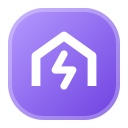

# Комуналка

**Зашифрованный учёт счётчиков и оплат для тех, кто снимает жильё.**<br>
Работает в вашем собственном Google-аккаунте, на телефоне и компьютере, на русском, украинском и английском.


[](LICENSE)

[English](README.md) · **Русский** · [Українська](README.uk.md)

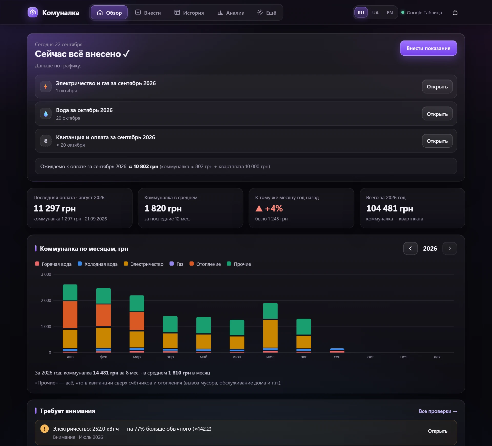

</div>

---

## Содержание

- [Зачем](#зачем)
- [Возможности](#возможности)
- [Скриншоты](#скриншоты)
- [Как защищены данные](#как-защищены-данные)
- [Установка (≈10 минут)](#установка-10-минут)
- [Как пользоваться](#как-пользоваться)
- [Доступ для семьи](#доступ-для-семьи)
- [Загрузка истории](#загрузка-истории)
- [Резервные копии и восстановление](#резервные-копии-и-восстановление)
- [Обновление программы](#обновление-программы)
- [Если что-то не работает](#если-что-то-не-работает)
- [Состав проекта](#состав-проекта)
- [Для разработчиков](#для-разработчиков)
- [Лицензия](#лицензия)
- [Автор](#автор)

---

## Зачем

Съёмная квартира — это ежемесячный ритуал: снять показания, проверить квитанцию, перевести деньги вместе с квартплатой и где-то всё это записать. Обычно — в таблицу, которая со временем превращается в трудночитаемую простыню.

Комуналка превращает такую таблицу в небольшое приложение:

- **подсказывает, что пора сделать** — по *вашему* графику;
- **считает** расход и сумму сразу, как только вы ввели показание;
- **находит ошибки** — отрицательный расход, необычные скачки, повторяющиеся номера оплат;
- хранит **фото и PDF квитанций** рядом с нужным месяцем;
- и всё это **шифруется на вашем устройстве** ещё до отправки в Google.

## Возможности

| | |
|---|---|
| 🗓 **Свой график** | Когда вносить каждый счётчик и когда оплачивать квитанцию (например, вода — 20-го, электричество и газ — 1-го числа следующего месяца). Главный экран показывает, что пора, что просрочено и что впереди. |
| ⚡ **Мгновенный расчёт** | Расход, сумма по каждому счётчику, сравнение с прошлым месяцем и тем же месяцем год назад, «обычный» уровень за 12 месяцев. |
| 🧾 **Квитанции и оплаты** | Отопление, сколько оплачено, квартплата, дата и номер операции. «Прочие расходы» считаются автоматически как остаток квитанции. |
| 📎 **Файлы** | Фото и PDF квитанций и чеков с комментариями. Фото уменьшаются автоматически. |
| 📊 **Анализ** | Графики по месяцам и «год к году», итоги по годам, общая шкала для горячей и холодной воды, автоматические проверки. |
| 💱 **Валюта** | По умолчанию гривна; в настройках можно выбрать евро, доллар, злотый, фунт и другие. |
| 🔁 **Смена тарифов и квартплаты** | Значения переносятся из прошлого месяца. Поменяли один раз — программа предложит обновить и следующие месяцы. |
| 🔔 **Напоминания** | Повторяющиеся напоминания в Google Календарь в одно касание или файл `.ics` для iPhone / Outlook. |
| 🌍 **Три языка** | Русский, украинский, английский — переключаются в любой момент. |
| 📱 **Удобно с телефона** | Значок на главном экране, нижнее меню, кнопка «Назад» браузера работает внутри программы. |
| 🔐 **Приватность** | Шифрование AES-256 вашим паролем, автоблокировка, доступ только для вашего Google-аккаунта. |
| 👨‍👩‍👧 **Доступ для семьи** | Программой могут пользоваться все, кто живёт в квартире — каждый входит под своим Google-аккаунтом, данные остаются зашифрованными. См. [Доступ для семьи](#доступ-для-семьи). |

## Скриншоты

> На всех скриншотах — **выдуманные демо-данные**.

<table>
<tr>
<td width="50%">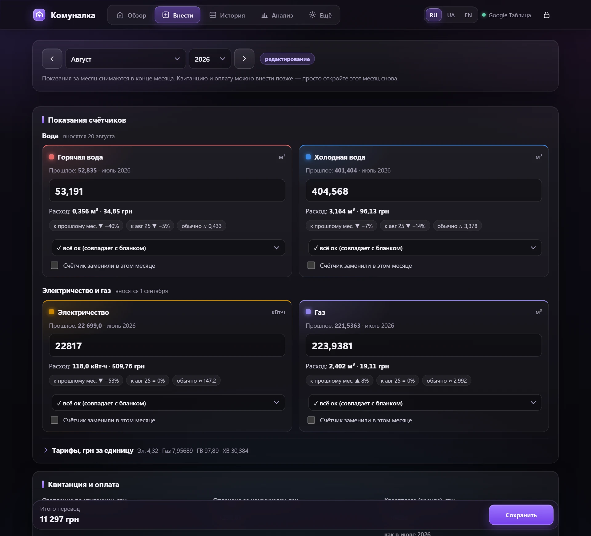<br><sub><b>Ввод показаний.</b> Счётчики сгруппированы по датам внесения; расход, сумма и сравнения появляются прямо во время ввода.</sub></td>
<td width="50%">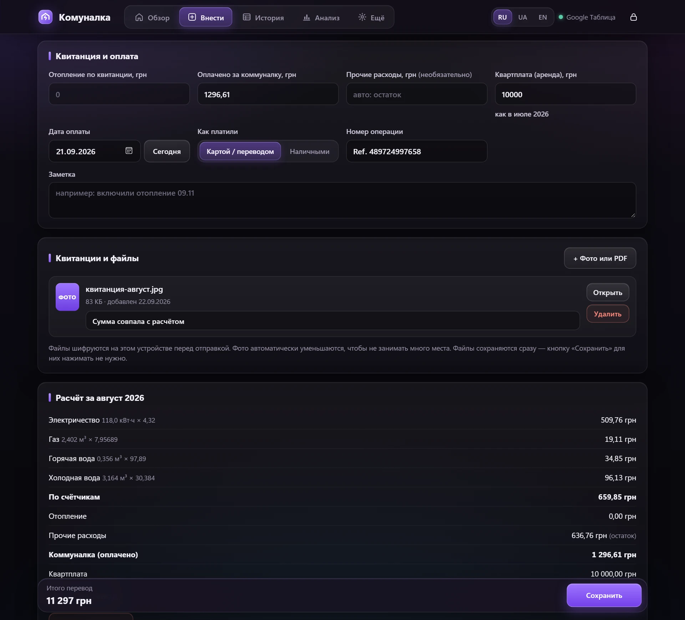<br><sub><b>Квитанция и оплата.</b> Прикрепите фото квитанции, добавьте комментарий, посмотрите полный расчёт за месяц.</sub></td>
</tr>
<tr>
<td>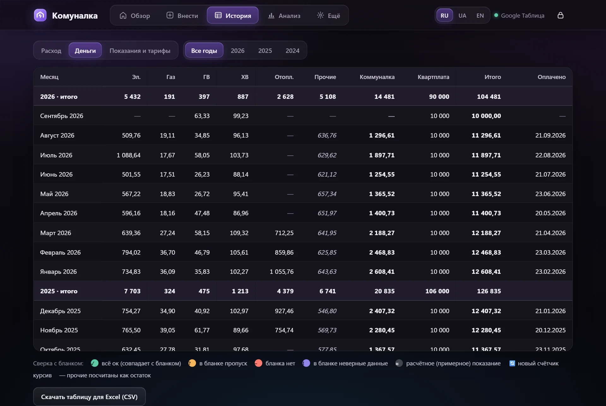<br><sub><b>История.</b> Таблица как в Excel: расход, деньги или показания и тарифы, с итогами по годам.</sub></td>
<td>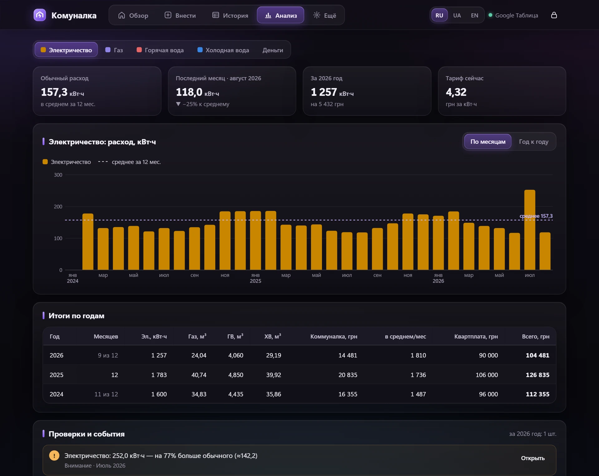<br><sub><b>Анализ.</b> Расход по месяцам со средним за 12 месяцев; режим «год к году»; итоги по годам.</sub></td>
</tr>
<tr>
<td>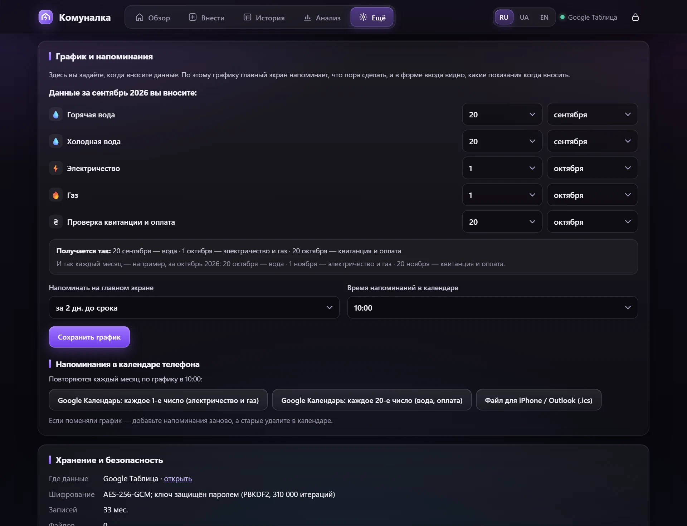<br><sub><b>График.</b> Даты задаются на примере текущего месяца — сводка ниже показывает, как это будет работать.</sub></td>
<td>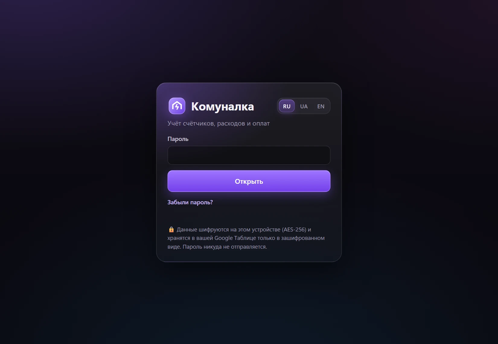<br><sub><b>Вход.</b> Пароль расшифровывает данные на вашем устройстве и никуда не отправляется.</sub></td>
</tr>
</table>

<p align="center">
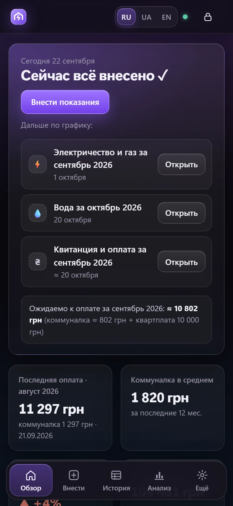
&nbsp;&nbsp;
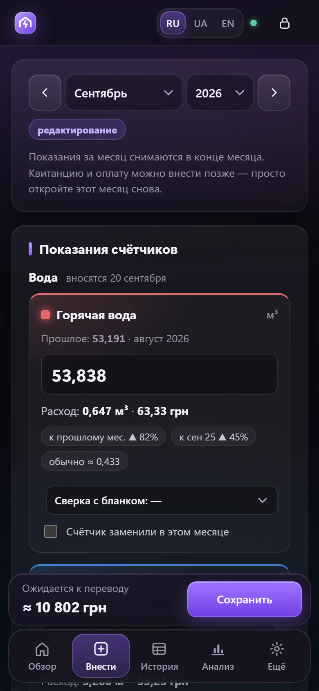
<br><sub>На телефоне: главный экран и форма ввода.</sub>
</p>

## Как защищены данные

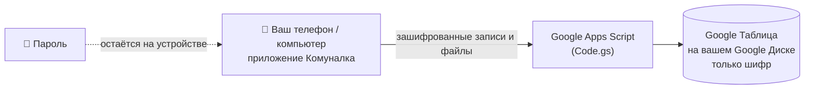

- **Шифрование происходит в браузере.** Из пароля получается ключ (PBKDF2-SHA-256, 310 000 итераций). Им защищён случайный 512-битный *ключ данных*, а уже ключ данных шифрует каждый месяц, настройки и каждый файл алгоритмом **AES-256-GCM**.
- **Google хранит только шифр.** В таблице — нечитаемые строки: ни показаний, ни сумм, ни заметок, ни фото в открытом виде. Скрыты даже названия месяцев: идентификаторы записей — это HMAC.
- **Доступ только у вас.** Веб-приложение разворачивается с настройками *«Запуск от имени: Я / У кого есть доступ: Только у меня»* — открыть его может только ваш Google-аккаунт.
- **Смена пароля мгновенная** — перешифровывается только небольшой ключ, а не все данные.
- **Автоблокировка** через 5–60 минут бездействия (по умолчанию 10).
- **Никакого стороннего кода.** Всё приложение — один HTML-файл без внешних скриптов.

> [!WARNING]
> **Пароль нельзя восстановить.** Без него данные не расшифрует никто — в том числе вы. Запишите пароль в надёжном месте и время от времени делайте зашифрованную копию.

> [!NOTE]
> Выгрузка в CSV и файл для загрузки истории **не** зашифрованы. Удаляйте их, когда они больше не нужны.

## Установка (≈10 минут)

Понадобится Google-аккаунт. Удобнее всего делать это с компьютера.

**0. Скачайте файлы.** На этой странице нажмите **Code → Download ZIP** и распакуйте архив. Нужны `Code.gs` и `Index.html`.

> [!TIP]
> Открывайте файлы обычным текстовым редактором: правая кнопка → *Открыть с помощью* → *Блокнот*. Если дважды щёлкнуть по `Index.html`, он откроется в браузере как программа, а не как текст.

1. **Создайте таблицу.** Откройте [sheets.google.com](https://sheets.google.com), создайте пустую таблицу и назовите её, например, *Комуналка*.
2. **Откройте редактор скриптов.** В меню таблицы: **Расширения → Apps Script**. Переименуйте проект (слева вверху, *Проект без названия*) в *Комуналка*.
3. **Добавьте серверную часть.** В редакторе уже есть файл `Код.gs`. Удалите в нём всё и вставьте целиком содержимое `Code.gs` из этого репозитория.
4. **Добавьте приложение.** Возле *Файлы* нажмите **+ → HTML** и назовите файл ровно **`Index`** (с большой буквы, `.html` редактор добавит сам). Удалите в нём всё и вставьте целиком содержимое `Index.html`. Вставленный текст должен заканчиваться на `</html>`.
5. **Сохраните** проект (💾 или `Ctrl+S`).
6. **Разверните.** **Начать развертывание → Новое развертывание**, шестерёнка ⚙ возле *Выберите тип* → **Веб-приложение**:
   - *Описание*: `Комуналка`
   - *Запуск от имени*: **Я**
   - *У кого есть доступ*: **Только у меня**

   Нажмите **Начать развертывание**.
7. **Разрешите доступ.** Google попросит разрешение → **Предоставить доступ** → выберите свой аккаунт. Появится *«Google не проверил это приложение»* — для собственного скрипта это нормально. Нажмите **Дополнительные настройки → Перейти на страницу «Комуналка» (небезопасно) → Разрешить**. Скрипт получает доступ **только к этой одной таблице**.
8. **Скопируйте URL веб-приложения** (заканчивается на `/exec`) и добавьте в закладки. Это и есть программа.
9. **Откройте ссылку** и придумайте пароль (не короче 8 символов).
10. **Настройки** (вкладка *Ещё*): выберите валюту, при желании впишите номер карты хозяина, проверьте график и добавьте напоминания в календарь.

**На телефоне:** откройте ту же ссылку `/exec` в Chrome (Android) или Safari (iPhone) под тем же Google-аккаунтом → меню браузера → **Добавить на главный экран**.

## Как пользоваться

1. **В день внесения** (главный экран напомнит) откройте **Внести**, впишите показания и нажмите **Сохранить**. Воду, электричество и газ можно вносить в разные дни — просто снова откройте тот же месяц.
2. **Когда пришла квитанция и вы оплатили**, откройте этот месяц и заполните *Отопление*, *Оплачено за коммуналку*, дату и номер операции. Прикрепите фото квитанции.
3. **Поменялся тариф или квартплата?** Впишите новое значение в **первом месяце**, с которого оно действует. Дальше оно подставится само; если в следующих месяцах уже стоит старое значение, программа предложит заменить и там.
4. **Заменили счётчик?** Отметьте *«Счётчик заменили в этом месяце»* и укажите начальное показание нового.
5. **Смотрите результаты:** *История* — всё в виде таблицы (нажмите на строку, чтобы исправить), *Анализ* — графики и проверки.

## Доступ для семьи

Одной Комуналкой могут пользоваться несколько человек — например, все, кто живёт в квартире. Все работают с одними и теми же данными, а входят **каждый под своим Google-аккаунтом**.

### Как это устроено

| | Только вы (по умолчанию) | Семья |
|---|---|---|
| *Запуск от имени* | Я | Пользователь, который открывает веб-приложение |
| *У кого есть доступ* | Только у меня | Все, у кого есть аккаунт Google |
| Кто может загрузить данные | только вы | только те, кому открыт доступ к таблице |
| Пароль программы | ваш | один на всю семью |

Apps Script не умеет разрешать веб-приложение списку конкретных людей. Поэтому программа запускается **от имени того, кто её открывает**, а доступ к данным определяется обычным доступом к Google Таблице. Человек, у которого есть ссылка, но нет доступа к таблице, ничего не загрузит — а без пароля программы данные всё равно остаются зашифрованными.

### Шаг 1. Откройте доступ к таблице

1. Откройте таблицу *Комуналка* → **Настройки доступа** (справа вверху).
2. Впишите Gmail каждого члена семьи и выберите роль **«Редактор»**.
3. Нажмите **«Отправить»**. Открывать саму таблицу им не нужно.

### Шаг 2. Поменяйте развертывание

1. В таблице: **Расширения → Apps Script**.
2. **Начать развертывание → Управление развертываниями** → ✏️ **Изменить**.
3. *Запуск от имени*: **Пользователь, который открывает веб-приложение** (по-английски *User accessing the web app*).
4. *У кого есть доступ*: **Все, у кого есть аккаунт Google** (*Anyone with Google account*).
5. *Версия*: **Новая версия** → **Развернуть**.

Ссылка `/exec` останется прежней, закладки продолжат работать. Google может ещё раз попросить разрешить доступ — так же, как при установке.

> Названия пунктов могут немного отличаться в зависимости от языка вашего Google-аккаунта — в скобках указаны английские.

### Шаг 3. Пригласите семью

1. Отправьте им ссылку `/exec`.
2. **Пароль программы сообщите лично** — не в том же сообщении, что и ссылку.

### Шаг 4. Первый вход (для каждого члена семьи)

1. Откройте ссылку, **войдя в тот Google-аккаунт, которому открыли доступ к таблице**.
2. Google попросит разрешение → **Предоставить доступ** → выберите аккаунт → *«Google не проверил это приложение»* → **Дополнительные настройки → Перейти на страницу «Комуналка» (небезопасно) → Разрешить**. Это тот же скрипт, и доступ у него только к этой одной таблице.
3. Вверху может появиться серая полоса *«Это приложение создано другим пользователем, а не Google»* — это нормально.
4. Введите пароль программы.
5. На телефоне: меню браузера → **Добавить на главный экран**.

### Безопасность и полезные правила

- **Давайте доступ только тем, кому доверяете.** Редакторы могут открыть таблицу (там только шифр) и код скрипта — и случайно или намеренно их испортить.
- **Один пароль на всех.** Настройки — карта, график, валюта, автоблокировка — тоже общие. Только язык интерфейса выбирается на каждом устройстве отдельно.
- **Одновременная правка.** Если двое одновременно правят **один и тот же месяц**, сохранится то, что сохранили последним. Разные месяцы и файлы друг другу не мешают. Когда вы возвращаетесь в программу, она подтягивает свежие данные.
- **Резервные копии** по-прежнему делает владелец: *Ещё → Скачать зашифрованную копию*.

### Как отключить человека

1. Таблица → **Настройки доступа** → возле человека выберите **«Удалить доступ»**.
2. В программе: **Ещё → Сменить пароль** и сообщите новый пароль остальным.

### Как вернуться к режиму «только я»

**Начать развертывание → Управление развертываниями** → ✏️ → *Запуск от имени*: **Я**, *У кого есть доступ*: **Только у меня** → *Версия*: **Новая версия** → **Развернуть**. При желании закройте и доступ к таблице.

### Если не получается

| Проблема | Решение |
|---|---|
| *«Не удалось загрузить данные»* или ошибка доступа | Таблица не открыта этому аккаунту, или в браузере выбран другой Google-аккаунт. |
| *«Не удалось открыть файл»* (часто на телефонах) | Браузер открывает ссылку под другим Google-аккаунтом. Проверьте в режиме инкогнито. На Android используйте браузер, в котором вошли только нужным аккаунтом; на iPhone выключите **Настройки → Safari → Запретить отслеживание между сайтами** или откройте ссылку в Chrome либо в приложении Google. |
| Ссылка открывается внутри Telegram / Viber | Нажмите **«Открыть в браузере»**. |
| Кто-то видит старую версию | Развертывание не обновлено до **новой версии**. |

## Загрузка истории

Если вы вели учёт в таблице, его можно загрузить разом: **Ещё → Загрузить историю из Excel (.json)** или кнопкой на пустом главном экране. Формат — простой JSON, пример: [`docs/import-example.json`](docs/import-example.json).

```json
{
  "app": "komunalka-import",
  "version": 1,
  "settings": { "rent": 10000 },
  "rows": [
    {
      "month": "2026-08",
      "readings": { "el": 22817.0, "gas": 223.9381, "hw": 53.191, "cw": 404.568 },
      "tariffs":  { "el": 4.32, "gas": 7.95689, "hw": 97.89, "cw": 30.384 },
      "status":   { "el": "ok" },
      "heating": 0,
      "paid": 1296.61,
      "rent": 10000,
      "payDate": "2026-09-21",
      "payMethod": "card",
      "payInfo": "Ref. 489724997658",
      "note": "Любой текст"
    }
  ]
}
```

| Поле | Что означает |
|---|---|
| `month` | `ГГГГ-ММ` — месяц, к которому относятся показания |
| `readings` | показания: `el` электричество, `gas` газ, `hw` горячая вода, `cw` холодная вода |
| `tariffs` | цена за единицу для каждого счётчика |
| `status` | сверка с бланком: `ok`, `gap` (пропуск в бланке), `noblank` (бланка нет), `wrong` (неверные данные), `est` (расчётное) |
| `newMeter` | `{ "cw": 0 }` — счётчик заменили; расход считается от этого начального показания |
| `heating` | сумма за отопление по квитанции |
| `other` | прочие расходы (необязательно; если нет — считаются как остаток от `paid`) |
| `paid` | сколько оплачено за коммуналку (без квартплаты) |
| `rent` | квартплата за месяц |
| `payMethod` | как платили: `card` (картой / переводом) или `cash` (наличными) — необязательно |
| `payDate`, `payInfo`, `note` | дата оплаты (`ГГГГ-ММ-ДД`), информация об операции, заметка |

Файл для загрузки **не** зашифрован — удалите его после загрузки.

## Резервные копии и восстановление

- **Зашифрованная копия:** *Ещё → Скачать зашифрованную копию*. Её можно хранить где угодно (Google Диск, флешка) — без пароля её не прочитать. Фото и PDF в копию не входят, они остаются в таблице. Саму таблицу тоже можно скопировать на Google Диске.
- **Восстановление:** *Ещё → Восстановить из копии* (нужен пароль, с которым копия была сделана).
- **Забыли пароль?** Откройте таблицу → меню **Комуналка → Удалить все данные**, затем задайте новый пароль и восстановите копию или снова загрузите историю.

## Обновление программы

Вставьте новые `Code.gs` / `Index.html` в редактор Apps Script → **Сохранить** → **Начать развертывание → Управление развертываниями** → ✏️ → *Версия*: **Новая версия** → **Развернуть**. Ссылка `/exec` останется прежней.

> [!TIP]
> Надёжнее всего копировать так: откройте файл на GitHub ([Index.html](Index.html)) и нажмите **Copy raw file** (значок с двумя квадратиками над кодом). В редакторе нажмите `Ctrl+A`, `Ctrl+V`, `Ctrl+S`, затем `Ctrl+End`: последняя строка должна быть `</html>`.

## Если что-то не работает

| Проблема | Решение |
|---|---|
| *«Не удалось открыть файл»* или другая ошибка Google | В браузере выполнен вход в несколько Google-аккаунтов. Откройте ссылку в режиме инкогнито или оставьте один аккаунт. На iPhone также выключите **Настройки → Safari → Запретить отслеживание между сайтами**. |
| Программа показывает старую версию | Код сохранён, но не развёрнута **новая версия** — см. «Обновление программы». |
| Бесконечная *«Загрузка…»* или сообщение *«Программа не запустилась: …»* | Обновите `Index.html` до последней версии (см. «Обновление программы»): версии, выпущенные до 22 сентября 2026 года, могли ломаться в Apps Script — подробности в разделе [Для разработчиков](#для-разработчиков). Если это случилось с последней версией, скопируйте файл заново через **Copy raw file**, проверьте, что он заканчивается на `</html>`, и разверните новую версию. На экране ошибки видна точная строка — приложите скриншот, когда [создаёте issue](https://github.com/Ki-developer/Komunalka/issues). |
| Пустая страница после вставки `Index.html` | Файл вставлен не полностью или называется не ровно `Index`. |
| Хочу попробовать без Google | Откройте `Index.html` прямо в браузере на компьютере. Программа заработает в *локальном режиме*: данные только в этом браузере, без телефона и без файлов. |
| Иконка вкладки | Задаётся в `Code.gs` (`FAVICON_URL`). Apps Script принимает только публичную ссылку на картинку `.png`. |

## Состав проекта

```
Code.gs                    серверная часть Apps Script: хранит зашифрованные записи и файлы в таблице
Index.html                 всё приложение: интерфейс, графики, шифрование, переводы — без внешних зависимостей
docs/import-example.json   выдуманная история в формате для загрузки
docs/screenshots/          скриншоты (демо-данные) на английском, русском и украинском
docs/logo.svg              логотип
LICENSE                    лицензия MIT
```

## Для разработчиков

**Apps Script может вырезать `//…` из страницы.** Когда `Index.html` большой, Apps Script иногда отдаёт его без всего, что стоит от `//` до конца строки, — даже внутри строк. Например, `'https://calendar…'` превращался в `'https:`, весь скрипт падал с ошибкой *Invalid or unexpected token*, и программа висела на «Загрузке…». Поэтому в `Index.html` не должно быть `//` и `/*` нигде, кроме настоящих комментариев:

- адреса внутри кода пишите как `'https:\/\/…'`;
- в SVG внутри data-URI используйте `%2F%2F` (`xmlns='http:%2F%2Fwww.w3.org%2F2000%2Fsvg'`);
- никаких регулярных выражений вида `/^image\//` — используйте `startsWith('image/')`.

Быстрая проверка после правок: сделайте копию без комментариев и откройте её в браузере — должен появиться экран входа с переключателем RU / UA / EN.

```bash
python -c "import re; s = open('Index.html', encoding='utf-8').read(); s = re.sub(r'//[^\n]*', '', s); s = re.sub(r'/\*.*?\*/', '', s, flags=re.S); open('stripped.html', 'w', encoding='utf-8').write(s)"
```

В Apps Script страница вставляется через `document.write`, поэтому номера строк в ошибках считаются от начала основного `<script>`, а не от начала файла.

## Лицензия

[MIT](LICENSE) — можно свободно использовать, копировать, изменять и распространять, в том числе в коммерческих целях, при условии сохранения уведомления об авторских правах. Программа предоставляется «как есть», без каких-либо гарантий.

## Автор

**Kyrylo Vasylenko**

[](https://www.linkedin.com/in/xg6nwh5sfw-kyr-vas/)

LinkedIn: [https://www.linkedin.com/in/xg6nwh5sfw-kyr-vas/](https://www.linkedin.com/in/xg6nwh5sfw-kyr-vas/)

Вопросы, идеи и сообщения об ошибках — создайте issue или напишите в LinkedIn.

<div align="center">
<sub>Сделано для настоящего ежемесячного ритуала квартиросъёмщика.</sub>
</div>
