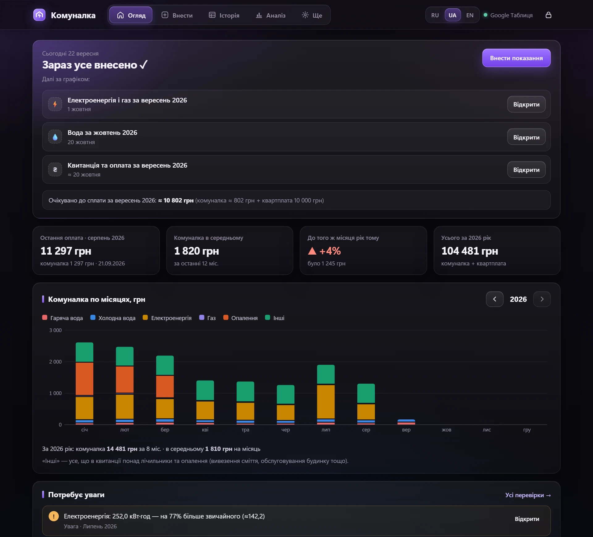
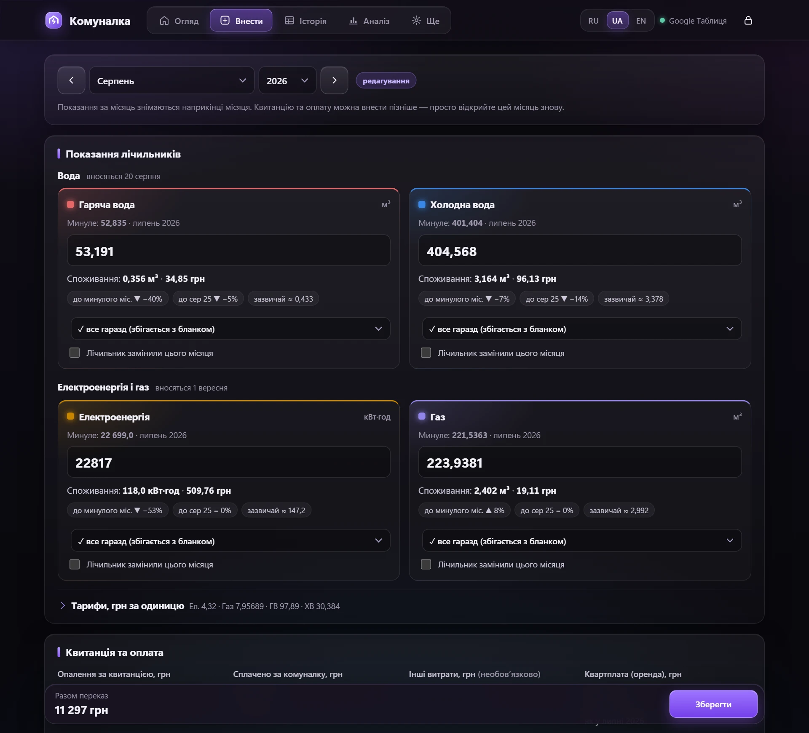
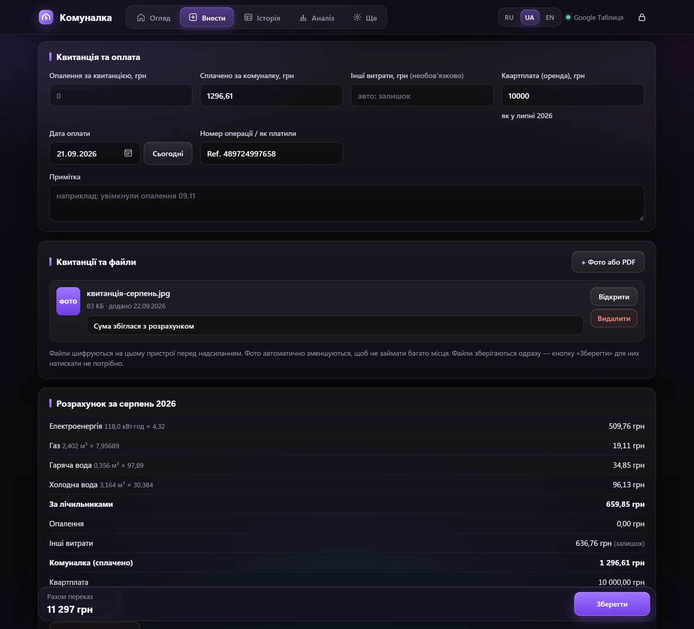
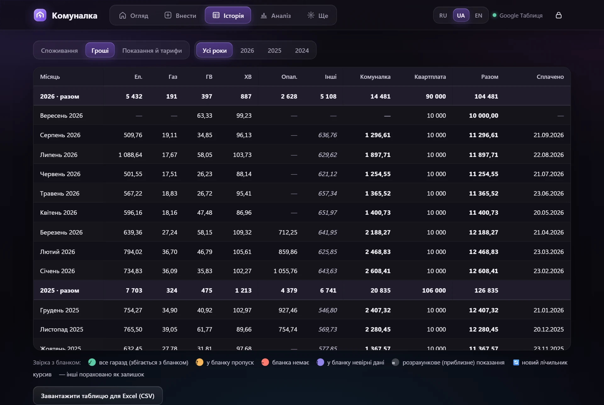
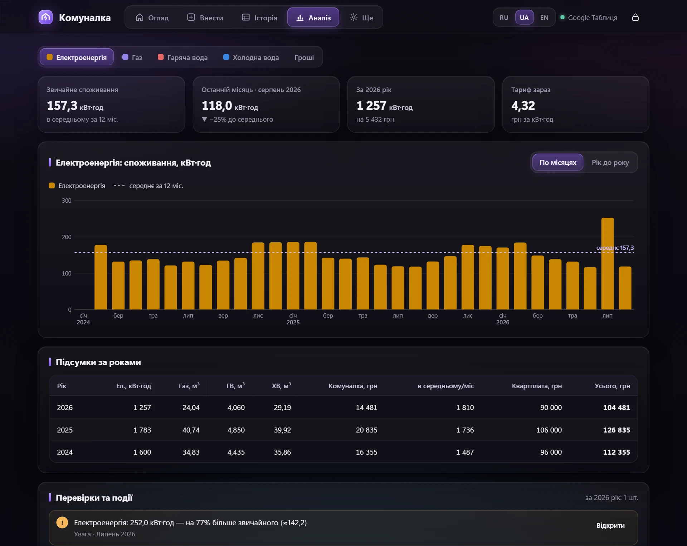
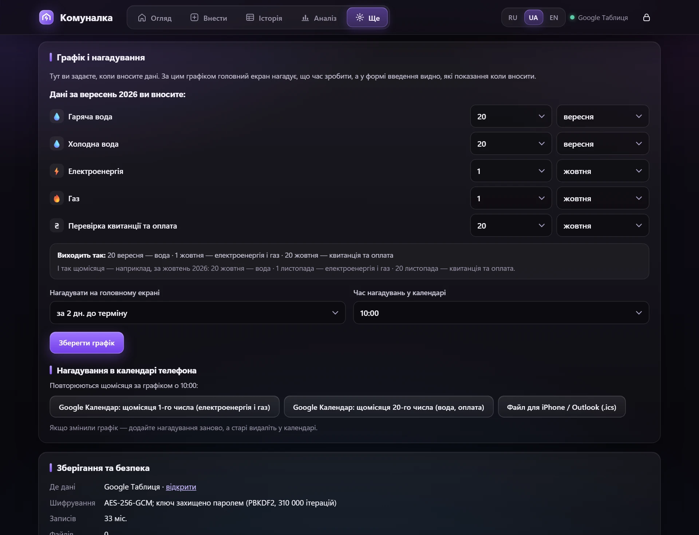
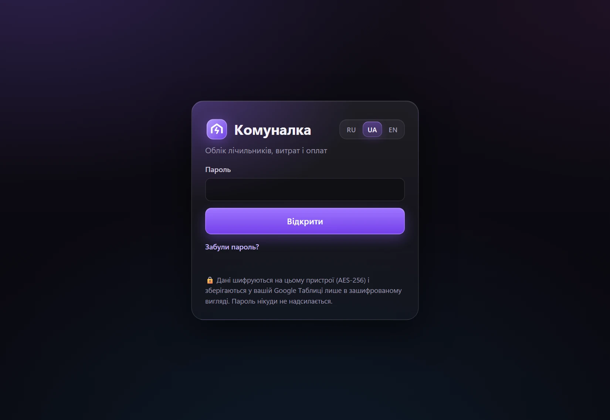
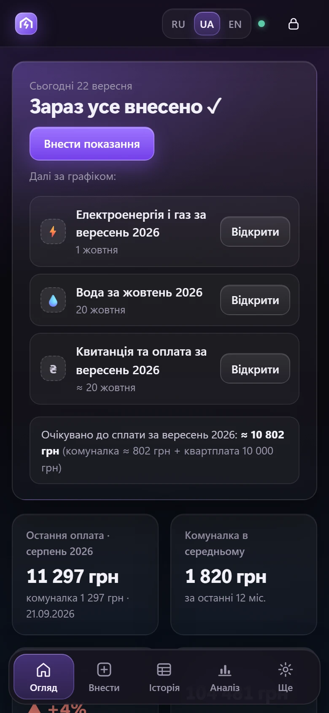
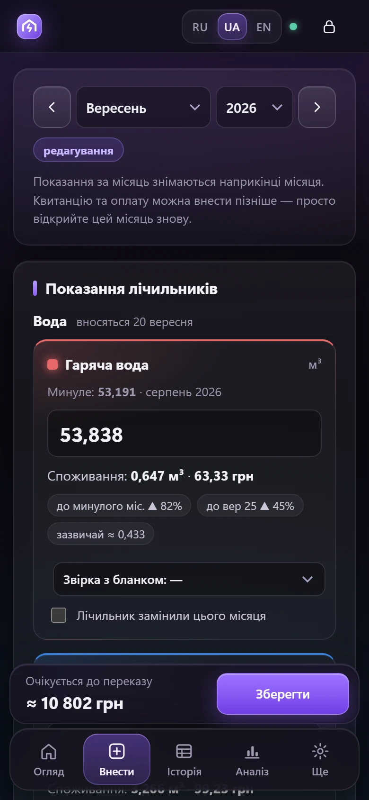
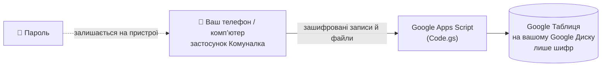

<div align="center">


# Комуналка

**Зашифрований облік лічильників і оплат для тих, хто орендує житло.**<br>
Працює у вашому власному Google-акаунті, на телефоні й комп’ютері, українською, російською та англійською.


[English](README.md) · [Русский](README.ru.md) · **Українська**



</div>

---

## Зміст

- [Навіщо](#навіщо)
- [Можливості](#можливості)
- [Скриншоти](#скриншоти)
- [Як захищені дані](#як-захищені-дані)
- [Встановлення (≈10 хвилин)](#встановлення-10-хвилин)
- [Як користуватися](#як-користуватися)
- [Завантаження історії](#завантаження-історії)
- [Резервні копії та відновлення](#резервні-копії-та-відновлення)
- [Оновлення програми](#оновлення-програми)
- [Якщо щось не працює](#якщо-щось-не-працює)
- [Склад проєкту](#склад-проєкту)

---

## Навіщо

Орендована квартира — це щомісячний ритуал: зняти показання, перевірити квитанцію, переказати гроші разом із квартплатою і десь це все записати. Зазвичай — у таблицю, яка з часом перетворюється на важко читабельне полотно.

Комуналка перетворює таку таблицю на невеликий застосунок:

- **підказує, що час зробити** — за *вашим* графіком;
- **рахує** споживання й суму одразу, щойно ви ввели показання;
- **знаходить помилки** — від’ємне споживання, незвичні стрибки, повторювані номери оплат;
- зберігає **фото й PDF квитанцій** поруч із потрібним місяцем;
- і все це **шифрується на вашому пристрої** ще до надсилання в Google.

## Можливості

| | |
|---|---|
| 🗓 **Свій графік** | Коли вносити кожен лічильник і коли оплачувати квитанцію (наприклад, вода — 20-го, електроенергія й газ — 1-го числа наступного місяця). Головний екран показує, що час, що прострочено і що попереду. |
| ⚡ **Миттєвий розрахунок** | Споживання, сума за кожним лічильником, порівняння з минулим місяцем і тим самим місяцем рік тому, «звичайний» рівень за 12 місяців. |
| 🧾 **Квитанції та оплати** | Опалення, скільки сплачено, квартплата, дата й номер операції. «Інші витрати» рахуються автоматично як залишок квитанції. |
| 📎 **Файли** | Фото й PDF квитанцій і чеків із коментарями. Фото зменшуються автоматично. |
| 📊 **Аналіз** | Графіки по місяцях і «рік до року», підсумки за роками, спільна шкала для гарячої та холодної води, автоматичні перевірки. |
| 💱 **Валюта** | За замовчуванням гривня; у налаштуваннях можна обрати євро, долар, злотий, фунт та інші. |
| 🔁 **Зміна тарифів і квартплати** | Значення переносяться з минулого місяця. Змінили один раз — програма запропонує оновити й наступні місяці. |
| 🔔 **Нагадування** | Повторювані нагадування в Google Календар в один дотик або файл `.ics` для iPhone / Outlook. |
| 🌍 **Три мови** | Українська, російська, англійська — перемикаються будь-коли. |
| 📱 **Зручно з телефона** | Значок на головному екрані, нижнє меню, кнопка «Назад» браузера працює всередині програми. |
| 🔐 **Приватність** | Шифрування AES-256 вашим паролем, автоблокування, доступ лише для вашого Google-акаунта. |

## Скриншоти

> На всіх скриншотах — **вигадані демо-дані**.

<table>
<tr>
<td width="50%"><br><sub><b>Введення показань.</b> Лічильники згруповані за датами внесення; споживання, сума й порівняння з’являються просто під час введення.</sub></td>
<td width="50%"><br><sub><b>Квитанція та оплата.</b> Прикріпіть фото квитанції, додайте коментар, перегляньте повний розрахунок за місяць.</sub></td>
</tr>
<tr>
<td><br><sub><b>Історія.</b> Таблиця як в Excel: споживання, гроші або показання й тарифи, з підсумками за роками.</sub></td>
<td><br><sub><b>Аналіз.</b> Споживання по місяцях із середнім за 12 місяців; режим «рік до року»; підсумки за роками.</sub></td>
</tr>
<tr>
<td><br><sub><b>Графік.</b> Дати задаються на прикладі поточного місяця — зведення нижче показує, як це працюватиме.</sub></td>
<td><br><sub><b>Вхід.</b> Пароль розшифровує дані на вашому пристрої й нікуди не надсилається.</sub></td>
</tr>
</table>

<p align="center">

&nbsp;&nbsp;

<br><sub>На телефоні: головний екран і форма введення.</sub>
</p>

## Як захищені дані



- **Шифрування відбувається в браузері.** З пароля отримується ключ (PBKDF2-SHA-256, 310 000 ітерацій). Ним захищено випадковий 512-бітний *ключ даних*, а вже ключ даних шифрує кожен місяць, налаштування й кожен файл алгоритмом **AES-256-GCM**.
- **Google зберігає лише шифр.** У таблиці — нечитабельні рядки: ані показань, ані сум, ані приміток, ані фото у відкритому вигляді. Приховані навіть назви місяців: ідентифікатори записів — це HMAC.
- **Доступ лише у вас.** Вебдодаток розгортається з налаштуваннями *«Виконувати як: Я / Хто має доступ: Лише я»* — відкрити його може тільки ваш Google-акаунт.
- **Зміна пароля миттєва** — перешифровується лише невеликий ключ, а не всі дані.
- **Автоблокування** через 5–60 хвилин бездіяльності (за замовчуванням 10).
- **Жодного стороннього коду.** Увесь застосунок — один HTML-файл без зовнішніх скриптів.

> [!WARNING]
> **Пароль неможливо відновити.** Без нього дані не розшифрує ніхто — зокрема й ви. Запишіть пароль у надійному місці й час від часу робіть зашифровану копію.

> [!NOTE]
> Вивантаження в CSV і файл для завантаження історії **не** зашифровані. Видаляйте їх, коли вони більше не потрібні.

## Встановлення (≈10 хвилин)

Знадобиться Google-акаунт. Найзручніше робити це з комп’ютера.

**0. Завантажте файли.** На цій сторінці натисніть **Code → Download ZIP** і розпакуйте архів. Потрібні `Code.gs` та `Index.html`.

> [!TIP]
> Відкривайте файли звичайним текстовим редактором: права кнопка → *Відкрити за допомогою* → *Блокнот*. Якщо двічі клацнути по `Index.html`, він відкриється в браузері як програма, а не як текст.

1. **Створіть таблицю.** Відкрийте [sheets.google.com](https://sheets.google.com), створіть порожню таблицю й назвіть її, наприклад, *Комуналка*.
2. **Відкрийте редактор скриптів.** У меню таблиці: **Розширення → Apps Script**. Перейменуйте проєкт (ліворуч угорі, *Проєкт без назви*) на *Комуналка*.
3. **Додайте серверну частину.** У редакторі вже є файл `Код.gs`. Видаліть у ньому все й вставте повністю вміст `Code.gs` із цього репозиторію.
4. **Додайте застосунок.** Біля *Файли* натисніть **+ → HTML** і назвіть файл рівно **`Index`** (з великої літери, `.html` редактор додасть сам). Видаліть у ньому все й вставте повністю вміст `Index.html`. Вставлений текст має закінчуватися на `</html>`.
5. **Збережіть** проєкт (💾 або `Ctrl+S`).
6. **Розгорніть.** **Розгорнути → Нове розгортання**, шестерня ⚙ біля *Вибрати тип* → **Вебдодаток**:
   - *Опис*: `Комуналка`
   - *Виконувати як*: **Я**
   - *Хто має доступ*: **Лише я**

   Натисніть **Розгорнути**.
7. **Надайте доступ.** Google попросить дозвіл → **Надати доступ** → оберіть свій акаунт. З’явиться *«Google не перевірив цей додаток»* — для власного скрипта це нормально. Натисніть **Додатково → Перейти на сторінку «Комуналка» (небезпечно) → Дозволити**. Скрипт отримує доступ **лише до цієї однієї таблиці**.
8. **Скопіюйте URL вебдодатка** (закінчується на `/exec`) і додайте в закладки. Це і є програма.
9. **Відкрийте посилання** й придумайте пароль (не коротше 8 символів).
10. **Налаштування** (вкладка *Ще*): оберіть валюту, за бажання впишіть номер картки власника, перевірте графік і додайте нагадування в календар.

> Назви кнопок Google можуть трохи відрізнятися залежно від мови інтерфейсу вашого акаунта.

**На телефоні:** відкрийте те саме посилання `/exec` у Chrome (Android) або Safari (iPhone) під тим самим Google-акаунтом → меню браузера → **Додати на головний екран**.

## Як користуватися

1. **У день внесення** (головний екран нагадає) відкрийте **Внести**, впишіть показання й натисніть **Зберегти**. Воду, електроенергію й газ можна вносити в різні дні — просто знову відкрийте той самий місяць.
2. **Коли прийшла квитанція і ви оплатили**, відкрийте цей місяць і заповніть *Опалення*, *Сплачено за комуналку*, дату й номер операції. Прикріпіть фото квитанції.
3. **Змінився тариф або квартплата?** Впишіть нове значення в **першому місяці**, з якого воно діє. Далі воно підставиться саме; якщо в наступних місяцях уже стоїть старе значення, програма запропонує замінити й там.
4. **Замінили лічильник?** Позначте *«Лічильник замінили цього місяця»* і вкажіть початкове показання нового.
5. **Дивіться результати:** *Історія* — усе у вигляді таблиці (натисніть на рядок, щоб виправити), *Аналіз* — графіки й перевірки.

## Завантаження історії

Якщо ви вели облік у таблиці, його можна завантажити одразу: **Ще → Завантажити історію з Excel (.json)** або кнопкою на порожньому головному екрані. Формат — простий JSON, приклад: [`docs/import-example.json`](docs/import-example.json).

```json
{
  "app": "komunalka-import",
  "version": 1,
  "settings": { "rent": 10000 },
  "rows": [
    {
      "month": "2026-08",
      "readings": { "el": 22817.0, "gas": 223.9381, "hw": 53.191, "cw": 404.568 },
      "tariffs":  { "el": 4.32, "gas": 7.95689, "hw": 97.89, "cw": 30.384 },
      "status":   { "el": "ok" },
      "heating": 0,
      "paid": 1296.61,
      "rent": 10000,
      "payDate": "2026-09-21",
      "payInfo": "Ref. 489724997658",
      "note": "Будь-який текст"
    }
  ]
}
```

| Поле | Що означає |
|---|---|
| `month` | `РРРР-ММ` — місяць, до якого належать показання |
| `readings` | показання: `el` електроенергія, `gas` газ, `hw` гаряча вода, `cw` холодна вода |
| `tariffs` | ціна за одиницю для кожного лічильника |
| `status` | звірка з бланком: `ok`, `gap` (пропуск у бланку), `noblank` (бланка немає), `wrong` (невірні дані), `est` (розрахункове) |
| `newMeter` | `{ "cw": 0 }` — лічильник замінили; споживання рахується від цього початкового показання |
| `heating` | сума за опалення за квитанцією |
| `other` | інші витрати (необов’язково; якщо немає — рахуються як залишок від `paid`) |
| `paid` | скільки сплачено за комуналку (без квартплати) |
| `rent` | квартплата за місяць |
| `payDate`, `payInfo`, `note` | дата оплати (`РРРР-ММ-ДД`), інформація про операцію, примітка |

Файл для завантаження **не** зашифрований — видаліть його після завантаження.

## Резервні копії та відновлення

- **Зашифрована копія:** *Ще → Завантажити зашифровану копію*. Її можна зберігати будь-де (Google Диск, флешка) — без пароля її не прочитати. Фото й PDF до копії не входять, вони залишаються в таблиці. Саму таблицю теж можна скопіювати на Google Диску.
- **Відновлення:** *Ще → Відновити з копії* (потрібен пароль, з яким копію було зроблено).
- **Забули пароль?** Відкрийте таблицю → меню **Комуналка → Удалить все данные** (*видалити всі дані*), потім задайте новий пароль і відновіть копію або знову завантажте історію.

## Оновлення програми

Вставте нові `Code.gs` / `Index.html` у редактор Apps Script → **Зберегти** → **Розгорнути → Керувати розгортаннями** → ✏️ → *Версія*: **Нова версія** → **Розгорнути**. Посилання `/exec` залишиться тим самим.

## Якщо щось не працює

| Проблема | Рішення |
|---|---|
| *«Не вдається відкрити файл»* або інша помилка Google | У браузері виконано вхід у кілька Google-акаунтів. Відкрийте посилання в режимі інкогніто або залиште один акаунт. |
| Програма показує стару версію | Код збережено, але не розгорнуто **нову версію** — див. «Оновлення програми». |
| Порожня сторінка після вставлення `Index.html` | Файл вставлено не повністю або він називається не рівно `Index`. |
| Хочу спробувати без Google | Відкрийте `Index.html` просто в браузері на комп’ютері. Програма запрацює в *локальному режимі*: дані лише в цьому браузері, без телефона й без файлів. |
| Іконка вкладки | Задається в `Code.gs` (`FAVICON_URL`). Apps Script приймає лише публічне посилання на картинку `.png`. |

## Склад проєкту

```
Code.gs                    серверна частина Apps Script: зберігає зашифровані записи й файли в таблиці
Index.html                 увесь застосунок: інтерфейс, графіки, шифрування, переклади — без зовнішніх залежностей
docs/import-example.json   вигадана історія у форматі для завантаження
docs/screenshots/          скриншоти (демо-дані) англійською, російською та українською
docs/logo.svg              логотип
```

<div align="center">
<sub>Зроблено для справжнього щомісячного ритуалу орендаря.</sub>
</div>
